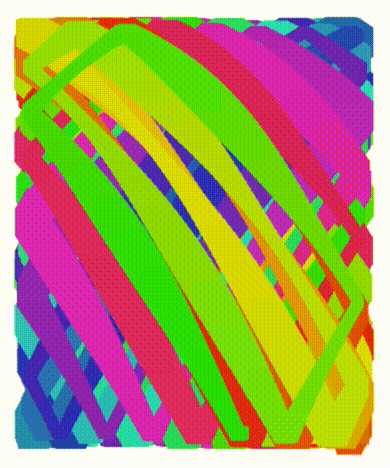
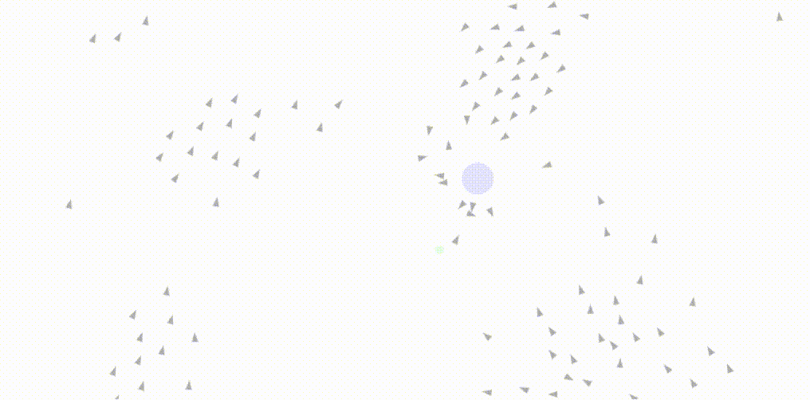

# Playing with animations using canvas + Reasonml

How to get running

```bash
git clone https://github.com/jaredly/rsnpaint
cd rsnpaint
yarn
yarn start     # this is the bucklescript (reason -> js) process
# open another tab
yarn run build # this is the webpack (js files -> finished bundle) process
```

Then open `index.html` in your favorite browser!

## Experiment 1

Basic stuff, let's have rectangle that bounces around the screen and changes
colors.



## Experiment 2

Let's implement flocking!

Algorithm based on [boids](http://www.red3d.com/cwr/boids/) using [this great
blog post](http://harry.me/blog/2011/02/17/neat-algorithms-flocking/) for some
tips.


